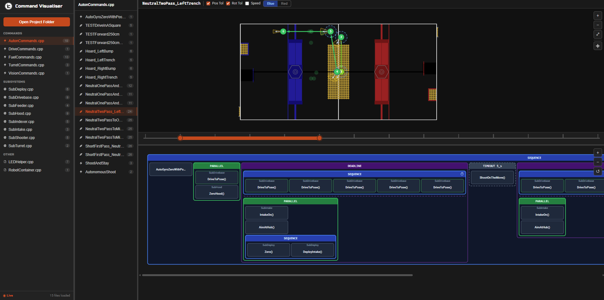
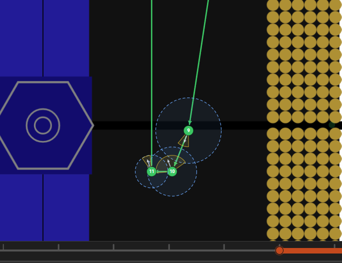
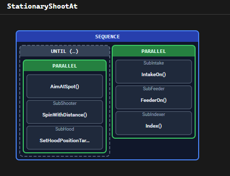

# FRC Command Visualiser

A browser-based tool for visualising FRC C++ command compositions — live at **https://liam-stow.github.io/commandvisualiser/**





## What it does

Point it at your robot code and it shows two views for any selected command:

- **Timeline** — a Gantt-style diagram of how commands nest (Sequence, Parallel, Race, Deadline, decorators). Hover nodes for details; hover a waypoint in the timeline to highlight it on the field.
- **Field** — an overhead field map showing the robot's planned drive path, with numbered pose markers, speed colour-coding, and optional tolerance overlays.

Supported C++ patterns: all `frc2::cmd::` factories, method-chain decorators (`AndThen`, `AlongWith`, `RaceWith`, `WithTimeout`, etc.), `ConditionalCommand`/`Either`, and subsystem leaf nodes.

## How to use

1. Open **https://liam-stow.github.io/commandvisualiser/** in Chrome or Edge (Firefox not supported — requires the File System Access API).
2. Click **Open folder** and select your robot project's source directory. The app scans all `.cpp`/`.h`/`.hpp` files recursively.
3. Pick a file from the left sidebar, then pick a command from the command panel.
4. The timeline and field views update automatically. If you opened via the folder picker, the app polls for file changes every 1.5 s so edits in your IDE appear without a reload.

### Field view extras

- **Zoom / pan** — scroll wheel or the `+` / `−` / fit buttons.
- **Coordinate picker** — click the crosshair button, then click anywhere on the field to read out the `frc::Pose2d` at that point. Scroll while hovering the marker to rotate it; click **Copy** to paste the literal into your code.
- **Range slider** — drag the handles below the field to show only a segment of the path.
- **Alliance toggle** — flip poses to red-alliance coordinates for commands that call `.flipForRed()`.

## Local development

```bash
npm install
npm run dev        # dev server at localhost:5173
npm test           # run tests once
npm run build      # type-check + production build
```
